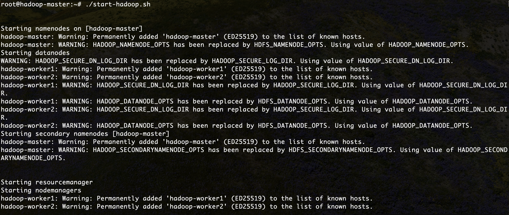
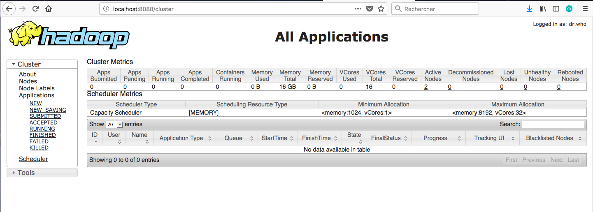
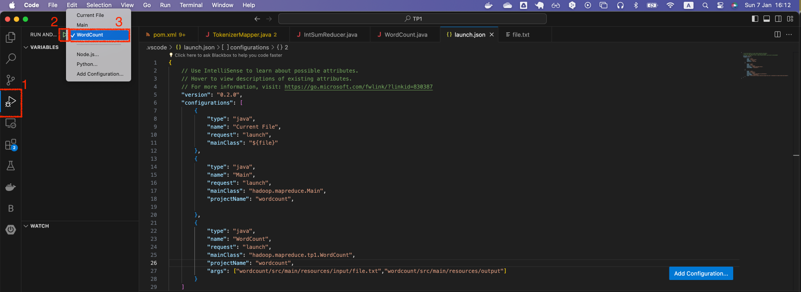

<center></center>


## Télécharger PDF
[](tp1.pdf)

## Objectifs du TP
Initiation au framework hadoop et au patron MapReduce, utilisation de docker pour lancer un cluster hadoop de 3 noeuds.

## Outils et Versions
* [Apache Hadoop](http://hadoop.apache.org/) Version: 3.3.6.
* [Docker](https://www.docker.com/) Version *latest*
* [Visual Studio Code](https://code.visualstudio.com/) Version 1.85.1 (ou tout autre IDE de votre choix)
* [Java](http://www.oracle.com/technetwork/java/javase/downloads/index.html) Version 1.8.
* Unix-like ou Unix-based Systems (Divers Linux et MacOS)

## Hadoop
### Présentation
[Apache Hadoop](hadoop.apache.org) est un framework open-source pour stocker et traiter les données volumineuses sur un cluster. Il est utilisé par un grand nombre de contributeurs et utilisateurs. Il a une licence Apache 2.0.

<center></center>


### Hadoop et Docker
Pour déployer le framework Hadoop, nous allons utiliser des contenaires [Docker](https://www.docker.com/). L'utilisation des contenaires va garantir la consistance entre les environnements de développement et permettra de réduire considérablement la complexité de configuration des machines (dans le cas d'un accès natif) ainsi que la lourdeur d'exécution (si on opte pour l'utilisation d'une machine virtuelle).

Nous avons pour le déploiement des ressources de ce TP suivi les instructions présentées [ici](https://github.com/kiwenlau/hadoop-cluster-docker).

### Installation
Nous allons utiliser tout au long de ces TP trois contenaires représentant respectivement un noeud maître (Namenode) et deux noeuds workers (Datanodes).

Vous devez pour cela avoir installé docker sur votre machine, et l'avoir correctement configuré. Ouvrir la ligne de commande, et taper les instructions suivantes:

1. Télécharger l'image docker uploadée sur dockerhub:
``` Bash
docker pull liliasfaxi/hadoop-cluster:latest
```
2. Créer les trois contenaires à partir de l'image téléchargée. Pour cela:
   2.1. Créer un réseau qui permettra de relier les trois contenaires:
    ``` Bash
    docker network create --driver=bridge hadoop
    ```
    2.2. Créer et lancer les trois contenaires (les instructions -p permettent de faire un mapping entre les ports de la machine hôte et ceux du contenaire):

    ```Bash
    docker run -itd --net=hadoop -p 9870:9870 -p 8088:8088 -p 7077:7077 -p 16010:16010 --name hadoop-master --hostname hadoop-master liliasfaxi/hadoop-cluster:latest

    docker run -itd -p 8040:8042 --net=hadoop --name hadoop-worker1 --hostname hadoop-worker1 liliasfaxi/hadoop-cluster:latest

    docker run -itd -p 8041:8042 --net=hadoop --name hadoop-worker2 --hostname hadoop-worker2 liliasfaxi/hadoop-cluster:latest
    ```
      2.3. Vérifier que les trois contenaires tournent bien en lançant la commande ```docker ps```. Un résultat semblable au suivant devra s'afficher:
      
      <center></center>

3. Entrer dans le contenaire master pour commencer à l'utiliser.

    ```Bash
    docker exec -it hadoop-master bash
    ```

Le résultat de cette exécution sera le suivant:

```Bash
root@hadoop-master:~#
```

Vous vous retrouverez dans le shell du namenode, et vous pourrez ainsi manipuler le cluster à votre guise. La première chose à faire, une fois dans le contenaire, est de lancer hadoop et yarn. Un script est fourni pour cela, appelé ```start-hadoop.sh```. Lancer ce script.

```Bash
./start-hadoop.sh
```

Le résultat devra ressembler à ce qui suit:


### Premiers pas avec Hadoop
Toutes les commandes interagissant avec le système HDFS commencent par ```hdfs dfs```. Ensuite, les options rajoutées sont très largement inspirées des commandes Unix standard.

  - Créer un répertoire dans HDFS, appelé _input_. Pour cela, taper:
```bash
hdfs dfs –mkdir -p input
```

??? bug "En cas d'erreur: _No such file or directory_"
    Si pour une raison ou une autre, vous n'arrivez pas à créer le répertoire _input_, avec un message ressemblant à ceci: ```ls: `.': No such file or directory```, veiller à construire l'arborescence de l'utilisateur principal (root), comme suit:

    ``` hdfs dfs -mkdir -p /user/root```

  - Nous allons utiliser le fichier  [purchases.txt](https://github.com/CodeMangler/udacity-hadoop-course/raw/master/Datasets/purchases.txt.gz) comme entrée pour le traitement MapReduce. Ce fichier se trouve déjà sous le répertoire principal de votre machine master.
  - Charger le fichier purchases dans le répertoire input que vous avez créé:
  ```Bash
  hdfs dfs –put purchases.txt input
  ```
  - Pour afficher le contenu du répertoire _input_, la commande est:
  ```bash
  hdfs dfs –ls input
  ```
  - Pour afficher les dernières lignes du fichier purchases:
  ```bash
  hdfs dfs -tail input/purchases.txt
  ```

  Le résultat suivant va donc s'afficher:
    <center></center>


Nous présentons dans le tableau suivant les commandes les plus utilisées pour manipuler les fichiers dans HDFS:

|Instruction|Fonctionnalité|
|---------|-------------------------------------------------------------|
| ```hdfs dfs –ls``` | Afficher le contenu du répertoire racine |
| ```hdfs dfs –put file.txt``` | Upload un fichier dans hadoop (à partir du répertoire courant de votre disque local) |
| ```hdfs dfs –get file.txt``` | Download un fichier à partir de hadoop sur votre disque local |
| ```hdfs dfs –tail file.txt``` | Lire les dernières lignes du fichier   |
| ```hdfs dfs –cat file.txt``` | Affiche tout le contenu du fichier  |
| ```hdfs dfs –mv file.txt newfile.txt``` |  Renommer (ou déplacer) le fichier  |
| ```hdfs dfs –rm newfile.txt``` | Supprimer le fichier  |
| ```hdfs dfs –mkdir myinput``` | Créer un répertoire |


### Interfaces web pour Hadoop

Hadoop offre plusieurs interfaces web pour pouvoir observer le comportement de ses différentes composantes. Il est possible d'afficher ces pages directement sur notre machine hôte, et ce grâce à l'utilisation de l'option -p de la commande ```docker run```. En effet, cette option permet de publier un port du contenaire sur la machine hôte. Pour pouvoir publier tous les ports exposés, vous pouvez lancer votre contenaire en utilisant l'option ```-P```.

En regardant la commande ```docker run``` utilisée plus haut, vous verrez que deux ports de la machine maître ont été exposés:

  * Le port **9870**: qui permet d'afficher les informations de votre namenode.
  * Le port **8088**: qui permet d'afficher les informations du resource manager de Yarn et visualiser le comportement des différents jobs.

Une fois votre cluster lancé et hadoop démarré et prêt à l'emploi, vous pouvez, sur votre navigateur préféré de votre machine hôte, aller à : http://localhost:9870. Vous obtiendrez le résultat suivant:


Vous pouvez également visualiser l'avancement et les résultats de vos Jobs (Map Reduce ou autre) en allant à l'adresse: http://localhost:8088.



## Map Reduce
### Présentation
Un Job Map-Reduce se compose principalement de deux types de programmes:

  - **Mappers** : permettent d’extraire les données nécessaires sous forme de clef/valeur, pour pouvoir ensuite les trier selon la clef
  - **Reducers** : prennent un ensemble de données triées selon leur clef, et effectuent le traitement nécessaire sur ces données (somme, moyenne, total...)

### Wordcount
Nous allons tester un programme MapReduce grâce à un exemple très simple, le _WordCount_, l'équivalent du _HelloWorld_ pour les applications de traitement de données. Le Wordcount permet de calculer le nombre de mots dans un fichier donné, en décomposant le calcul en deux étapes:

  * L'étape de _Mapping_, qui permet de découper le texte en mots et de délivrer en sortie un flux textuel, où chaque ligne contient le mot trouvé, suivi de la valeur 1 (pour dire que le mot a été trouvé une fois)
  * L'étape de _Reducing_, qui permet de faire la somme des 1 pour chaque mot, pour trouver le nombre total d'occurrences de ce mot dans le texte.

Commençons par créer un projet Maven dans VSCode. **Nous utiliserons dans notre cas JDK 1.8**.

??? info "Version de JDK"
    Ceci n'est pas une suggestion: l'utilisation d'une autre version que 1.8 provoquera des erreurs sans fin. Hadoop est compilé avec cette version de Java, connue pour sa stabilité. 

Pour créer un projet Maven dans VSCode: 

  * Prenez soin d'avoir les extensions _Maven for Java_ et _Extension Pack for Java_ activées.
  * Créer un nouveau répertoire dans lequel vous inclurez votre code.
  * Faites un clic-droit dans la fenêtre _Explorer_ et choisir *Create Maven Project*.  
  * Choisir _No Archetype_
  * Définir les valeurs suivantes pour votre projet:
    - **GroupId**: hadoop.mapreduce
    - **ArtifactId**: wordcount
    - **Version**: 1
  * Ouvrir le fichier _pom.xml_ automatiquement créé, et ajouter les dépendances suivantes pour Hadoop, HDFS et Map Reduce:

```xml
  <dependencies>
     <!-- https://mvnrepository.com/artifact/org.apache.hadoop/hadoop-common -->
      <dependency>
          <groupId>org.apache.hadoop</groupId>
          <artifactId>hadoop-common</artifactId>
          <version>3.3.6</version>
      </dependency>
      <!-- https://mvnrepository.com/artifact/org.apache.hadoop/hadoop-mapreduce-client-core -->
      <dependency>
          <groupId>org.apache.hadoop</groupId>
          <artifactId>hadoop-mapreduce-client-core</artifactId>
          <version>3.3.6</version>
      </dependency>
      <!-- https://mvnrepository.com/artifact/org.apache.hadoop/hadoop-hdfs -->
      <dependency>
          <groupId>org.apache.hadoop</groupId>
          <artifactId>hadoop-hdfs</artifactId>
          <version>3.3.6</version>
      </dependency>
      <!-- https://mvnrepository.com/artifact/org.apache.hadoop/hadoop-mapreduce-client-common -->
      <dependency>
          <groupId>org.apache.hadoop</groupId>
          <artifactId>hadoop-mapreduce-client-common</artifactId>
          <version>3.3.6</version>
      </dependency>
      <!-- https://mvnrepository.com/artifact/org.apache.hadoop/hadoop-mapreduce-client-jobclient -->
      <dependency>
          <groupId>org.apache.hadoop</groupId>
          <artifactId>hadoop-mapreduce-client-jobclient</artifactId>
          <version>3.3.6</version>
      </dependency>

  </dependencies>
```

  * Créer un package _tp1_ sous le répertoire _src/main/java/hadoop/mapreduce_
  * Créer la classe _TokenizerMapper_, contenant ce code:

```java
  package hadoop.mapreduce.tp1;

  import org.apache.hadoop.io.IntWritable;
  import org.apache.hadoop.io.Text;
  import org.apache.hadoop.mapreduce.Mapper;

  import java.io.IOException;
  import java.util.StringTokenizer;

  public class TokenizerMapper
        extends Mapper<Object, Text, Text, IntWritable>{

    private final static IntWritable one = new IntWritable(1);
    private Text word = new Text();

    public void map(Object key, Text value, Mapper.Context context
    ) throws IOException, InterruptedException {
        StringTokenizer itr = new StringTokenizer(value.toString());
        while (itr.hasMoreTokens()) {
            word.set(itr.nextToken());
            context.write(word, one);
        }
    }
  }
```

  * Créer la classe _IntSumReducer_:

```java
package hadoop.mapreduce.tp1;

import org.apache.hadoop.io.IntWritable;
import org.apache.hadoop.io.Text;
import org.apache.hadoop.mapreduce.Reducer;

import java.io.IOException;

public class IntSumReducer
        extends Reducer<Text,IntWritable,Text,IntWritable> {

    private IntWritable result = new IntWritable();

    public void reduce(Text key, Iterable<IntWritable> values,
                       Context context
    ) throws IOException, InterruptedException {
        int sum = 0;
        for (IntWritable val : values) {
            System.out.println("value: "+val.get());
            sum += val.get();
        }
        System.out.println("--> Sum = "+sum);
        result.set(sum);
        context.write(key, result);
    }
}

```

  * Enfin, créer la classe _WordCount_:

```java
package hadoop.mapreduce.tp1;

import org.apache.hadoop.conf.Configuration;
import org.apache.hadoop.fs.Path;
import org.apache.hadoop.io.IntWritable;
import org.apache.hadoop.io.Text;
import org.apache.hadoop.mapreduce.Job;
import org.apache.hadoop.mapreduce.lib.input.FileInputFormat;
import org.apache.hadoop.mapreduce.lib.output.FileOutputFormat;

public class WordCount {
    public static void main(String[] args) throws Exception {
        Configuration conf = new Configuration();
        Job job = Job.getInstance(conf, "word count");
        job.setJarByClass(WordCount.class);
        job.setMapperClass(TokenizerMapper.class);
        job.setCombinerClass(IntSumReducer.class);
        job.setReducerClass(IntSumReducer.class);
        job.setOutputKeyClass(Text.class);
        job.setOutputValueClass(IntWritable.class);
        FileInputFormat.addInputPath(job, new Path(args[0]));
        FileOutputFormat.setOutputPath(job, new Path(args[1]));
        System.exit(job.waitForCompletion(true) ? 0 : 1);
    }
}

```
#### Tester Map Reduce en local
Dans votre projet sur VSCode:

  * Créer un répertoire _input_ sous le répertoire _resources_ de votre projet.
  * Créer un fichier de test: _file.txt_ dans lequel vous insèrerez les deux lignes:
```
  Hello Wordcount!
  Hello Hadoop!
```
  * Nous allons maintenant définir des arguments à la méthode Main: le fichier en entrée sur lequel Map reduce va travailler, et le répertoire en sortie dans lequel le résultat sera stocké. Pour cela:
    * Ouvrir le fichier launch.json de votre projet (Aller à la fenêtre _Run and Debug_ , puis cliquer sur _create a launch.json file_).
    * Ajouter la ligne suivante dans la configuration **WordCount**, dont la classe principale est _hadoop.mapreduce.tp1.WordCount_: 
    ```json
    "args": ["wordcount/src/main/resources/input/file.txt","wordcount/src/main/resources/output"]
    ```
    ???note "Arguments"
        Il est à noter que, dans mon cas, le fichier _launch.json_ a été créé sous le répertoire _TP1_, c'est pour cette raison que le chemin des fichiers commence par "wordcount". Si vous créez la configuration directement sous le répertoire _wordcount_, il faudra commencer le chemin par _src_.

  * Sélectionner ensuite, dans la liste des configurations du projet, _WordCount_ comme configuration par défaut:

  

  * Lancer le programme. Un répertoire _output_ sera créé dans le répertoire _resources_, contenant notamment un fichier _part-r-00000_, dont le contenu devrait être le suivant:
  
  ```
  Hadoop!	1
  Hello	2
  Wordcount!	1
  ```

#### Lancer Map Reduce sur le cluster
Dans votre projet VSCode:

  * Pour pouvoir encapsuler toutes les dépendances du projet dans le fichier JAR à exporter, ajouter le plugin suivant dans le fichier _pom.xml_ de votre projet:

  
  ```xml hl_lines="10"
  <build>
    <plugins>
      <plugin>
        <groupId>org.apache.maven.plugins</groupId>
        <artifactId>maven-assembly-plugin</artifactId>
        <version>3.6.0</version> <!-- Use latest version -->
        <configuration>
          <archive>
            <manifest>
              <mainClass>hadoop.mapreduce.tp1.WordCount</mainClass>
            </manifest>
          </archive>
          <descriptorRefs>
            <descriptorRef>jar-with-dependencies</descriptorRef>
          </descriptorRefs>
        </configuration>
        <executions>
          <execution>
            <id>make-assembly</id> <!-- this is used for inheritance merges -->
            <phase>package</phase> <!-- bind to the packaging phase -->
            <goals>
              <goal>single</goal>
            </goals>
          </execution>
        </executions>
      </plugin>
    </plugins>
  </build>
  ```

  * Aller dans l'Explorer, sous Maven, puis ouvrir le _Lifecycle_ du projet wordcount.
  * Cliquer sur ```package``` pour compiler et packager le projet dans un fichier JAR. Un fichier _wordcount-1.0-SNAPSHOT-jar-with-dependencies.jar_ sera créé sous le répertoire _target_ du projet.
  * Copier le fichier jar créé dans le contenaire master. Pour cela:
    - Ouvrir le terminal sur le répertoire du projet _wordcount_. Cela peut être fait avec VSCode en allant au menu _Terminal -> New Terminal_.
    - Taper la commande suivante:
    ```bash
    docker cp target/wordcount-1.0-SNAPSHOT-jar-with-dependencies.jar hadoop-master:/root/wordcount.jar
    ```

  * Revenir au shell du contenaire master, et lancer le job map reduce avec cette commande:
  
```bash
  hadoop jar wordcount.jar input output
```

Le Job sera lancé sur le fichier _purchases.txt_ que vous aviez préalablement chargé dans le répertoire _input_ de HDFS. Une fois le Job terminé, un répertoire _output_ sera créé. Si tout se passe bien, vous obtiendrez un affichage ressemblant au suivant:


En affichant les dernières lignes du fichier généré _output/part-r-00000_, avec ```hdfs dfs -tail output/part-r-00000```, vous obtiendrez l'affichage suivant:


Il vous est possible de monitorer vos Jobs Map Reduce, en allant à la page: ```http://localhost:8088```. Vous trouverez votre Job dans la liste des applications comme suit:


Il est également possible de voir le comportement des noeuds workers, en allant à l'adresse: ```http://localhost:8041``` pour _worker1_, et ```http://localhost:8042``` pour _worker2_. Vous obtiendrez ce qui suit:


!!! note "Application"
    Écrire un Job Map Reduce permettant, à partir du fichier _purchases_ initial, de déterminer le total des ventes par magasin. Il est à noter que la structure du fichier _purchases_ est de la forme suivante:
    ```
      date   temps   magasin   produit   cout   paiement
    ```
    Veiller à toujours tester votre code en local avant de lancer un job sur le cluster!

## Homework
Vous allez, pour ce cours, réaliser un projet en trinôme ou quadrinôme, qui consiste en la construction d'une architecture Big Data supportant le streaming, le batch processing, et le dashboarding temps réel. Pour la séance prochaine, vous allez commencer par mettre les premières pierres à l'édifice:

* Choisir la source de données sur laquelle vous allez travailler. Je vous invite à consulter les datasets offerts par [Kaggle](https://www.kaggle.com/) par exemple, ou chercher une source de streaming tel que Twitter.
* Réfléchir à l'architecture cible. La pipeline devrait intégrer des traitements en batch, des traitements en streaming et une visualisation.


