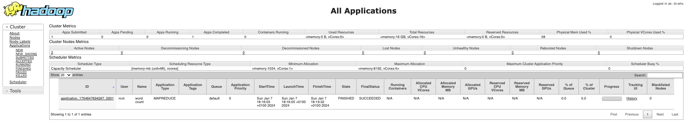

# TP1 - Le traitement Batch avec Hadoop HDFS et Map Reduce

<center></center>


## Télécharger PDF
[](tp1.pdf)

## Objectifs du TP
Initiation au framework hadoop et au patron MapReduce, utilisation de docker pour lancer un cluster hadoop de 3 noeuds.

## Outils et Versions
* [Apache Hadoop](http://hadoop.apache.org/) Version: 2.7.2.
* [Docker](https://www.docker.com/) Version 17.09.1
* [IntelliJ IDEA](https://www.jetbrains.com/idea/download/) Version Ultimate 2016.1 (ou tout autre IDE de votre choix)
* [Java](http://www.oracle.com/technetwork/java/javase/downloads/index.html) Version 1.8.
* Unix-like ou Unix-based Systems (Divers Linux et MacOS)

## Hadoop
### Présentation
[Apache Hadoop](hadoop.apache.org) est un framework open-source pour stocker et traiter les données volumineuses sur un cluster. Il est utilisé par un grand nombre de contributeurs et utilisateurs. Il a une licence Apache 2.0.

<center></center>


### Hadoop et Docker
Pour déployer le framework Hadoop, nous allons utiliser des contenaires [Docker](https://www.docker.com/). L'utilisation des contenaires va garantir la consistance entre les environnements de développement et permettra de réduire considérablement la complexité de configuration des machines (dans le cas d'un accès natif) ainsi que la lourdeur d'exécution (si on opte pour l'utilisation d'une machine virtuelle).

Nous avons pour le déploiement des ressources de ce TP suivi les instructions présentées [ici](https://github.com/kiwenlau/hadoop-cluster-docker).

### Installation
Nous allons utiliser tout au long de ce TP trois contenaires représentant respectivement un noeud maître (Namenode) et deux noeuds esclaves (Datanodes).

Vous devez pour cela avoir installé docker sur votre machine, et l'avoir correctement configuré. Ouvrir la ligne de commande, et taper les instructions suivantes:

1. Cloner le repo github contenant les fichiers nécessaires pour le lancement des contenaires et leur configuration:
``` Bash
  git clone https://github.com/liliasfaxi/hadoop-cluster-docker
```
2. Construire l'image Docker à partir du fichier Dockerfile fourni.
``` Bash
  cd hadoop-cluster-docker
  ./build-image.sh
```
3. Démarrer les trois contenaires:
```Bash
  sudo ./start-container.sh
```

!!! warning "Attention"
    Le script _start-container.sh_ va réinitialiser les trois contenaires. Si vous voulez redémarrer un contenaire déjà créé, il ne faut pas l'exécuter de nouveau: tout sera effacé. Au lieu de cela, utiliser plutôt _docker start <container_id\>_. Pour lancer le shell, taper simplement (pour le master container, par exemple):

    ```Bash
        docker exec -it hadoop-master bash
    ```

Le résultat de cette exécution sera le suivant:

```Bash
  start hadoop-master container...
  start hadoop-slave1 container...
  start hadoop-slave2 container...
  root@hadoop-master:~#
```

Vous vous retrouverez dans le shell du namenode, et vous pourrez ainsi manipuler le cluster à votre guise. La première chose à faire, une fois dans le contenaire, est de lancer hadoop et yarn. Un script est fourni pour cela, appelé _start-hadoop.sh_. Lancer ce script.

```Bash
  ./start-hadoop.sh
```

Le résultat devra ressembler à ce qui suit:


### Premiers pas avec Hadoop
Toutes les commandes interagissant avec le système Hadoop commencent par hadoop fs. Ensuite, les options rajoutées sont très largement inspirées des commandes Unix standard.

  - Créer un répertoire dans HDFS, appelé _input_. Pour cela, taper:
```bash
  hadoop fs –mkdir -p input
```

!!! bug "Erreur"
    Si pour une raison ou une autre, vous n'arrivez pas à créer le répertoire _input_, avec un message ressemblant à ceci: ```ls: `.': No such file or directory```, veiller à construire l'arborescence de l'utilisateur principal (root), comme suit:

    ``` hadoop fs -mkdir -p /user/root```

  - Nous allons utiliser le fichier  [purchases.txt](https://s3-eu-west-1.amazonaws.com/insat.lilia.bigdata.bucket/data/purchases.txt) comme entrée pour le traitement MapReduce. Ce fichier se trouve déjà sous le répertoire principal de votre machine master.
  - Charger le fichier purchases dans le répertoire input que vous avez créé:
  ```Bash
    hadoop fs –put purchases.txt input
  ```
  - Pour afficher le contenu du répertoire _input_, la commande est:
  ```bash
    hadoop fs –ls input
  ```
  - Pour afficher les dernières lignes du fichier purchases:
  ```bash
    hadoop fs -tail input/purchases.txt
  ```

  Le résultat suivant va donc s'afficher:
    <center></center>


Nous présentons dans le tableau suivant les commandes les plus utilisées pour manipuler les fichiers dans HDFS:

|Instruction|Fonctionnalité|
|---------|-------------------------------------------------------------|
| ```hadoop fs –ls``` | Afficher le contenu du répertoire racine |
| ```hadoop fs –put file.txt``` | Upload un fichier dans hadoop (à partir du répertoire courant linux) |
| ```hadoop fs –get file.txt``` | Download un fichier à partir de hadoop sur votre disque local |
| ```hadoop fs –tail file.txt``` | Lire les dernières lignes du fichier   |
| ```hadoop fs –cat file.txt``` | Affiche tout le contenu du fichier  |
| ```hadoop fs –mv file.txt newfile.txt``` |  Renommer le fichier  |
| ```hadoop fs –rm newfile.txt``` | Supprimer le fichier  |
| ```hadoop fs –mkdir myinput``` | Créer un répertoire |
| ```hadoop fs –cat file.txt \| less``` | Lire le fichier page par page|

### Interfaces web pour Hadoop

Hadoop offre plusieurs interfaces web pour pouvoir observer le comportement de ses différentes composantes. Vous pouvez afficher ces pages en local sur votre machine grâce à l'option -p de la commande ```docker run```. En effet, cette option permet de publier un port du contenaire sur la machine hôte. Pour pouvoir publier tous les ports exposés, vous pouvez lancer votre contenaire en utilisant l'option ```-P```.

En regardant le contenu du fichier ```start-container.sh``` fourni dans le projet, vous verrez que deux ports de la machine maître ont été exposés:

  * Le port **50070**: qui permet d'afficher les informations de votre namenode.
  * Le port **8088**: qui permet d'afficher les informations du resource manager de Yarn et visualiser le comportement des différents jobs.

Une fois votre cluster lancé et prêt à l'emploi, vous pouvez, sur votre navigateur préféré de votre machine hôte, aller à : ```http://localhost:50070```. Vous obtiendrez le résultat suivant:


Vous pouvez également visualiser l'avancement et les résultats de vos Jobs (Map Reduce ou autre) en allant à l'adresse: ```http://localhost:8088```


## Map Reduce
### Présentation
Un Job Map-Reduce se compose principalement de deux types de programmes:

  - **Mappers** : permettent d’extraire les données nécessaires sous forme de clef/valeur, pour pouvoir ensuite les trier selon la clef
  - **Reducers** : prennent un ensemble de données triées selon leur clef, et effectuent le traitement nécessaire sur ces données (somme, moyenne, total...)

### Wordcount
Nous allons tester un programme MapReduce grâce à un exemple très simple, le _WordCount_, l'équivalent du _HelloWorld_ pour les applications de traitement de données. Le Wordcount permet de calculer le nombre de mots dans un fichier donné, en décomposant le calcul en deux étapes:

  * L'étape de _Mapping_, qui permet de découper le texte en mots et de délivrer en sortie un flux textuel, où chaque ligne contient le mot trouvé, suivi de la valeur 1 (pour dire que le mot a été trouvé une fois)
  * L'étape de _Reducing_, qui permet de faire la somme des 1 pour chaque mot, pour trouver le nombre total d'occurrences de ce mot dans le texte.

Commençons par créer un projet Maven dans IntelliJ IDEA. Nous utiliserons dans notre cas JDK 1.8.

  * Définir les valeurs suivantes pour votre projet:
    - **GroupId**: hadoop.mapreduce
    - **ArtifactId**: wordcount
    - **Version**: 1
  * Ouvrir le fichier _pom.xml_, et ajouter les dépendances suivantes pour Hadoop, HDFS et Map Reduce:

```xml
  <dependencies>
      <dependency>
          <groupId>org.apache.hadoop</groupId>
          <artifactId>hadoop-common</artifactId>
          <version>2.7.2</version>
      </dependency>
      <!-- https://mvnrepository.com/artifact/org.apache.hadoop/hadoop-mapreduce-client-core -->
      <dependency>
          <groupId>org.apache.hadoop</groupId>
          <artifactId>hadoop-mapreduce-client-core</artifactId>
          <version>2.7.2</version>
      </dependency>
      <!-- https://mvnrepository.com/artifact/org.apache.hadoop/hadoop-hdfs -->
      <dependency>
          <groupId>org.apache.hadoop</groupId>
          <artifactId>hadoop-hdfs</artifactId>
          <version>2.7.2</version>
      </dependency>
      <dependency>
            <groupId>org.apache.hadoop</groupId>
            <artifactId>hadoop-mapreduce-client-common</artifactId>
            <version>2.7.2</version>
        </dependency>
  </dependencies>
```

  * Créer un package _tn.insat.tp1_ sous le répertoire _src/main/java_
  * Créer la classe _TokenizerMapper_, contenant ce code:

```java
  package tn.insat.tp1;

  import org.apache.hadoop.io.IntWritable;
  import org.apache.hadoop.io.Text;
  import org.apache.hadoop.mapreduce.Mapper;

  import java.io.IOException;
  import java.util.StringTokenizer;

  public class TokenizerMapper
        extends Mapper<Object, Text, Text, IntWritable>{

    private final static IntWritable one = new IntWritable(1);
    private Text word = new Text();

    public void map(Object key, Text value, Mapper.Context context
    ) throws IOException, InterruptedException {
        StringTokenizer itr = new StringTokenizer(value.toString());
        while (itr.hasMoreTokens()) {
            word.set(itr.nextToken());
            context.write(word, one);
        }
    }
  }
```

  * Créer la classe _IntSumReducer_:

```java
package tn.insat.tp1;

import org.apache.hadoop.io.IntWritable;
import org.apache.hadoop.io.Text;
import org.apache.hadoop.mapreduce.Reducer;

import java.io.IOException;

public class IntSumReducer
        extends Reducer<Text,IntWritable,Text,IntWritable> {

    private IntWritable result = new IntWritable();

    public void reduce(Text key, Iterable<IntWritable> values,
                       Context context
    ) throws IOException, InterruptedException {
        int sum = 0;
        for (IntWritable val : values) {
            System.out.println("value: "+val.get());
            sum += val.get();
        }
        System.out.println("--> Sum = "+sum);
        result.set(sum);
        context.write(key, result);
    }
}

```

  * Enfin, créer la classe _WordCount_:

```java
package tn.insat.tp1;

import org.apache.hadoop.conf.Configuration;
import org.apache.hadoop.fs.Path;
import org.apache.hadoop.io.IntWritable;
import org.apache.hadoop.io.Text;
import org.apache.hadoop.mapreduce.Job;
import org.apache.hadoop.mapreduce.lib.input.FileInputFormat;
import org.apache.hadoop.mapreduce.lib.output.FileOutputFormat;

public class WordCount {
    public static void main(String[] args) throws Exception {
        Configuration conf = new Configuration();
        Job job = Job.getInstance(conf, "word count");
        job.setJarByClass(WordCount.class);
        job.setMapperClass(TokenizerMapper.class);
        job.setCombinerClass(IntSumReducer.class);
        job.setReducerClass(IntSumReducer.class);
        job.setOutputKeyClass(Text.class);
        job.setOutputValueClass(IntWritable.class);
        FileInputFormat.addInputPath(job, new Path(args[0]));
        FileOutputFormat.setOutputPath(job, new Path(args[1]));
        System.exit(job.waitForCompletion(true) ? 0 : 1);
    }
}

```
#### Tester Map Reduce en local
Dans votre projet sur IntelliJ:

  * Créer un répertoire _input_ sous le répertoire _resources_ de votre projet.
  * Créer un fichier de test: _file.txt_ dans lequel vous insèrerez les deux lignes:
```
  Hello Wordcount!
  Hello Hadoop!
```
  * Créer une configuration de type _Application_ (_Run->Edit Configurations...->+->Application_).
  * Définir comme **Main Class**: tn.insat.tp1.WordCount, et comme **Program Arguments**: ```src/main/resources/input/file.txt src/main/resources/output```
  * Lancer le programme. Un répertoire _output_ sera créé dans le répertoire _resources_, contenant notamment un fichier _part-r-00000_, dont le contenu devrait être le suivant:

```
Hadoop!	1
Hello	2
Wordcount!	1
```

#### Lancer Map Reduce sur le cluster
Dans votre projet IntelliJ:

  * Créer une configuration Maven avec la ligne de commande: ```package install```
  * Lancer la configuration. Un fichier _wordcount-1.jar_ sera créé dans le répertoire _target_ du projet.
  * Copier le fichier jar créé dans le contenaire master. Pour cela:
    - Ouvrir le terminal sur le répertoire du projet. Cela peut être fait avec IntelliJ en ouvrant la vue _Terminal_ située en bas à gauche de la fenêtre principale.

    - Taper la commande suivante:
```Bash
  docker cp target/wordcount-1.jar hadoop-master:/root/wordcount-1.jar
```

  * Revenir au shell du contenaire master, et lancer le job map reduce avec cette commande:

```Bash
  hadoop jar wordcount-1.jar tn.insat.tp1.WordCount input output
```

Le Job sera lancé sur le fichier _purchases.txt_ que vous aviez préalablement chargé dans le répertoire _input_ de HDFS. Une fois le Job terminé, un répertoire _output_ sera créé. Si tout se passe bien, vous obtiendrez un affichage ressemblant au suivant:


En affichant les dernières lignes du fichier généré _output/part-r-00000_, avec ```hadoop fs -tail output/part-r-00000```, vous obtiendrez l'affichage suivant:


Il vous est possible de monitorer vos Jobs Map Reduce, en allant à la page: ```http://localhost:8088```. Vous trouverez votre Job dans la liste des applications comme suit:



Il est également possible de voir le comportement des noeuds esclaves, en allant à l'adresse: ```http://localhost:8041``` pour _slave1_, et ```http://localhost:8042``` pour _slave2_. Vous obtiendrez ce qui suit:


!!! note "Application"
    Écrire un Job Map Reduce permettant, à partir du fichier purchases initial, de déterminer le total des ventes par magasin. La structure du fichier purchases est de la forme suivante:
    ```
      date   temps   magasin   produit   cout   paiement
    ```
    Veiller à toujours tester votre code en local avant de lancer un job sur le cluster!

## Homework
Pour la séance prochaine, l'objectif est d'utiliser un cluster AWS-EMR (Elastic Map Reduce) de Amazon pour exécuter un Job Map Reduce de votre choix sur un vrai cluster distribué. Pour cela, utiliser les comptes [RosettaHub](https://www.rosettahub.com) qui vous ont été fournis.
