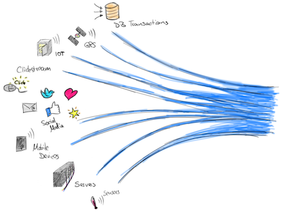

# TP2 - Traitement en Streaming avec Flink

## Télécharger PDF

## Objectifs du TP
Création d'un processus métier (Business Process) en utilisant Camunda.

## Outils et Versions
* [Camunda](https://camunda.org/download/) Version: 7.7.0
* [Java](http://www.oracle.com/technetwork/java/javase/downloads/index-jsp-138363.html) Version 1.8.0_121 (7+ needed).
* [IntelliJ IDEA](https://www.jetbrains.com/idea/download/) Version Ultimate 2016.1 (ou tout autre IDE de votre choix)
* [Camunda Modeler](https://camunda.org/download/modeler/) Version 1.10.0
