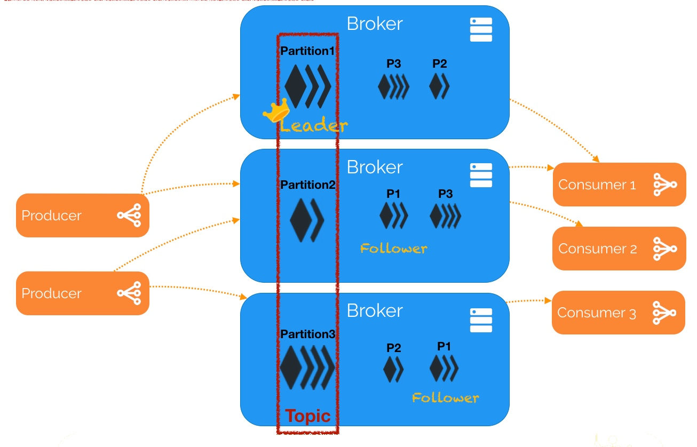

# TP3 - La Collecte de données avec le Bus Kafka

<center></center>

## Télécharger PDF
[](tp3.pdf)

## Objectifs du TP
Utilisation de Kafka pour une collecte de données distribuée, et intégration avec Spark.

## Outils et Versions
* [Apache Kafka](https://kafka.apache.org/) Version 2.11-0.8.2.1
* [Apache Hadoop](http://hadoop.apache.org/) Version: 2.7.2
* [Apache Spark](https://spark.apache.org/) Version: 2.2.1
* [Docker](https://www.docker.com/) Version 17.09.1
* [IntelliJ IDEA](https://www.jetbrains.com/idea/download/) Version Ultimate 2016.1 (ou tout autre IDE de votre choix)
* [Java](http://www.oracle.com/technetwork/java/javase/downloads/index.html) Version 1.8
* Unix-like ou Unix-based Systems (Divers Linux et MacOS)

## Kafka

### Qu'est-ce qu'un système de messaging?
Un système de messaging (_Messaging System_) est responsable du transfert de données d'une application à une autre, de manière à ce que les applications puissent se concentrer sur les données sans s'inquiéter de la manière de les partager ou de les collecter. Le messaging distribué est basé sur le principe de file de message fiable. Les messages sont stockés de manière asynchrone dans des files d'attente entre les applications clientes et le système de messaging.

Deux types de patrons de messaging existent: Les systèmes "_point à point_" et les systèmes "_publish-subscribe_".

#### 1. Systèmes de messaging Point à Point
Dans un système point à point, les messages sont stockés dans une file. un ou plusieurs consommateurs peuvent consommer les message dans la file, mais un message ne peut être consommé que par un seul consommateur à la fois. Une fois le consommateur lit le message, ce dernier disparaît de la file.

<center>

</center>

#### 2. Systèmes de messaging Publish/Subscribe
Dans un système publish-subscribe, les messages sont stockés dans un "_topic_". Contrairement à un système point à point, les consommateurs peuvent souscrire à un ou plusieurs topics et consommer tous les messages de ce topic.

<center>

</center>

### Présentation de Kafka
Apache [Kafka](https://kafka.apache.org/) est une plateforme de streaming qui bénéficie de trois fonctionnalités:

  1. Elle vous permet de publier et souscrire à un flux d'enregistrements. Elle ressemble ainsi à une file demessage ou un système de messaging d'entreprise.
  2. Elle permet de stocker des flux d'enregistrements d'une façon tolérante aux pannes.
  3. Elle vous permet de traiter (au besoin) les enregistrements au fur et à mesure qu'ils arrivent.

<center></center>

Les principaux avantages de Kafka sont:

  1. **_La fiablitié_**: Kafka est distribué, partitionné, répliqué et tolérent aux fautes.
  2. **_La scalabilité_**: Kafka se met à l'échelle facilement et sans temps d'arrêt.
  3. **_La durabilité_**: Kafka utilise un _commit log_ distribué, ce qui permet de stocker les messages sur le disque le plus vite possible.
  4. **_La performance_**: Kafka a un débit élevé pour la publication et l'abonnement.

### Architecture de Kafka
Pour comprendre le fonctionnement de Kafka, il faut d'abord se familiariser avec le vocabulaire suivant:

  1. **Topic**: Un flux de messages appartenant à une catégorie particulière. Les données sont stockées dans des topics.
  2. **Partitions**: Chaque topic est divisé en partitions. Pour chaque topic, Kafka conserve un minimum d'une partition. Chaque partition contient des messages dans une séquence ordonnée immuable. Une partition est implémentée comme un ensemble de sègments de tailles égales.
  3. **Offset**: Les enregistrements d'une partition ont chacun un identifiant séquentiel appelé _offset_, qui permet de l'identifier de manière unique dans la partition.
  4. **Répliques**: Les répliques sont des _backups_ d'une partition. Elles ne sont jamais lues ni modifiées par les acteurs externes, elles servent uniquement à prévenir la perte de données.
  5. **Brokers**: Les _brokers_ (ou courtiers) sont de simples systèmes responsables de maintenir les données publiées. Chaque courtier peut avoir zéro ou plusieurs partitions par topic. Si un topic admet N partitions et N courtiers, chaque courtier va avoir une seule partition. Si le nombre de courtiers est plus grand que celui des partitions, certains n'auront aucune partition de ce topic.
  6. **Cluster**: Un système Kafka ayant plus qu'un seul Broker est appelé _cluster Kafka_. L'ajout de nouveau brokers est fait de manière transparente sans temps d'arrêt.
  7. **Producers**: Les producteurs sont les éditeurs de messages à un ou plusieurs topics Kafka. Ils envoient des données aux courtiers Kafka. Chaque fois qu'un producteur publie un message à un courtier, ce dernier rattache le message au dernier sègment, ajouté ainsi à une partition. Un producteur peut également envoyer un message à une partition particulière.
  8. **Consumers**: Les consommateurs lisent les données à partir des brokers. Ils souscrivent à un ou plusieurs topics, et consomment les messages publiés en extrayant les données à partir des brokers.
  9. **Leaders**: Le leader est le noeud responsable de toutes les lectures et écritures d'une partition donnée. Chaque partition a un serveur jouant le rôle de leader.
  10. **Follower**: C'est un noeud qui suit les instructions du leader. Si le leader tombe en panne, l'un des followers deviendra automatiquement le nouveau leader.

La figure suivante montre un exemple de flux entre les différentes parties d'un système Kafka:
<center>

</center>

Dans cet exemple, un topic est configuré en trois partitions. La partition 1 admet deux enregistrements d'offsets respectifs 0 et 1, la partition 2 a quatre enregistrements et la partition 3 a un seul enregistrement.

En supposant que, si le facteur de réplication du topic est de 3, alors Kafka va créer trois répliques identiques de chaque partition et les placer dans le cluster pour les rendre disponibles pour toutes les opérations. L'identifiant de la réplique est le même que l'identifiant du serveur qui l'héberge. Pour équilibrer la charge dans le cluster, chaque broker stocke une ou plusieurs de ces partitions. Plusieurs producteurs et consommateurs peuvent publier et extraire les messages au même moment.

### Kafka et Zookeeper
[Zookeeper](https://zookeeper.apache.org/) est un service centralisé permettant de maintenir l'information de configuration, de nommage, de synchronisation et de services de groupe. Ces services sont utilisés par les applications distribuées en général, et par Kafka en particulier. Pour éviter la complexité et difficulté de leur implémentation manuelle, Zookeeper est utilisé.


Un cluster Kafka consiste typiquement en plusieurs courtiers (Brokers) pour maintenir la répartition de charge. Ces courtiers sont stateless, c'est pour cela qu'ils utilisent Zookeeper pour maintenir l'état du cluster. Un courtier peut gérer des centaines de milliers de lectures et écritures par seconde, et chaque courtier peut gérer des téra-octets de messages sans impact sur la performance.

Zookeeper est utilisé pour gérer et coordonner les courtiers Kafka. Il permet de notifier les producteurs et consommateurs de messages de la présence de tout nouveau courtier, ou de l'échec d'un courtier dans le cluster.

### Installation
Kafka a été installé sur le même cluster que les deux TP précédents. Si vous disposez des contenaires, vous n'avez rien à faire. Sinon, vous pourrez les installer avec Docker comme suit:

1. Cloner le repo github contenant les fichiers nécessaires pour le lancement des contenaires et leur configuration:
``` Bash
  git clone https://github.com/liliasfaxi/hadoop-cluster-docker
```
2. Construire l'image Docker à partir du fichier Dockerfile fourni.
``` Bash
  cd hadoop-cluster-docker
  ./build-image.sh
```
3. Démarrer les trois contenaires:
```Bash
  sudo ./start-container.sh
```
Le résultat de cette exécution sera le suivant:
```Bash
  start hadoop-master container...
  start hadoop-slave1 container...
  start hadoop-slave2 container...
  root@hadoop-master:~#
```
4. Lancer Kafka et Zookeeper en tapant :
```Bash
  ./start-kafka-zookeeper.sh
```
Les deux démons Kafka et Zookeeper seront lancés. Vous pourrez vérifier cela en tapant `jps` pour voir quels processus Java sont en exécution, vous devriez trouver les processus suivants:
```Bash
  2756 Kafka
  53 QuorumPeerMain
  6349 Jps
```

## Première utilisation de Kafka
### Création d'un topic
Pour gérer les topics, Kafka fournit une commande appelée `kafka-topics.sh`.
Dans un nouveau terminal, taper la commande suivante pour créer un nouveau topic appelé "Hello-Kafka".

```Bash
  kafka-topics.sh --create --zookeeper localhost:2181
                  --replication-factor 1 --partitions 1
                  --topic Hello-Kafka
```

!!! warning "Attention"
      Cette commande fonctionne car nous avions rajouté /usr/local/kafka/bin à la variable d'environnement PATH. Si ce n'était pas le cas, on aurait du appeler /usr/local/kafka/bin/kafka-topics.sh

Pour afficher la liste des topics existants, il faudra utiliser:

```Bash
  kafka-topics.sh --list --zookeeper localhost:2181
```

Le résultat devrait être (parmi un grand nombre de lignes d'INFO):

```
  Hello-Kafka
```

### Exemple Producteur Consommateur
Kafka fournit un exemple de producteur standard que vous pouvez directement utiliser. Il suffit de taper:

```Bash
  kafka-console-producer.sh --broker-list localhost:9092 --topic Hello-Kafka
```

Tout ce que vous taperez dorénavant sur la console sera envoyé à Kafka. L'option ```--broker-list``` permet de définir la liste des courtiers auxquels vous enverrez le message. Pour l'instant, vous n'en disposez que d'un, et il est déployé à l'adresse localhost:9092.

Pour lancer un consommateur, utiliser:

```Bash
  kafka-console-consumer.sh --zookeeper localhost:2181 —topic Hello-Kafka
--from-beginning
```

Le résultat devra ressembler au suivant:


### Configuration de plusieurs brokers
Dans ce qui précède, nous avons configuré Kafka pour lancer un seul broker. Pour créer plusieurs brokers, il suffit de dupliquer le fichier ```$KAFKA_HOME/config/server.properties``` autant de fois que nécessaire. Dans notre cas, nous allons créer deux autre fichiers: ```server-one.properties``` et ```server-two.properties```, puis nous modifions les paramètres suivants comme suit:

```properties
  ### config/server-one.properties
  broker.id = 1
  listeners=PLAINTEXT://localhost:9093
  log.dirs=/tmp/kafka-logs-1

  ### config/server-two.properties
  broker.id = 2
  listeners=PLAINTEXT://localhost:9094
  log.dirs=/tmp/kafka-logs-2
```

 Pour démarrer les différents brokers, il suffit d'appeler ```kafka-server-start.sh``` avec les nouveaux fichiers de configuration.

 ```Bash
  kafka-server-start.sh $KAFKA_HOME/config/server.properties &
  kafka-server-start.sh $KAFKA_HOME/config/server-one.properties &
  kafka-server-start.sh $KAFKA_HOME/config/server-two.properties &
 ```

 Lancer ```jps``` pour voir les trois serveurs s'exécuter.

## Création d'une application personnalisée

 Nous allons dans cette partie créer une application pour publier et consommer des messages de Kafka. Pour cela, nous allons utiliser KafkaProducer API et KafkaConsumer API.

### Producteur

 Pour créer un producteur Kafka, créer un fichier dans un répertoire de votre choix dans le contenaire master, intitulé ```SimpleProducer.java```. Son code est le suivant:

 ```Java
 import java.util.Properties;
 import org.apache.kafka.clients.producer.Producer;
 import org.apache.kafka.clients.producer.KafkaProducer;
 import org.apache.kafka.clients.producer.ProducerRecord;

  public class SimpleProducer {

    public static void main(String[] args) throws Exception{

       // Verifier que le topic est donne en argument
       if(args.length == 0){
          System.out.println("Entrer le nom du topic");
          return;
       }

       // Assigner topicName a une variable
       String topicName = args[0].toString();

       // Creer une instance de proprietes pour acceder aux configurations du producteur
       Properties props = new Properties();

       // Assigner l'identifiant du serveur kafka
       props.put("bootstrap.servers", "localhost:9092");

       // Definir un acquittement pour les requetes du producteur
       props.put("acks", "all");

       // Si la requete echoue, le producteur peut reessayer automatiquemt
       props.put("retries", 0);

       // Specifier la taille du buffer size dans la config
       props.put("batch.size", 16384);

       // buffer.memory controle le montant total de memoire disponible au producteur pour le buffering
       props.put("buffer.memory", 33554432);

       props.put("key.serializer",
          "org.apache.kafka.common.serialization.StringSerializer");

       props.put("value.serializer",
          "org.apache.kafka.common.serialization.StringSerializer");

       Producer<String, String> producer = new KafkaProducer
          <String, String>(props);

       for(int i = 0; i < 10; i++)
          producer.send(new ProducerRecord<String, String>(topicName,
             Integer.toString(i), Integer.toString(i)));
                System.out.println("Message envoye avec succes");
                producer.close();
    }
  }
 ```

ProducerRecord est une paire clef/valeur envoyée au cluster Kafka. Son constructeur peut prendre 4, 3 ou 2 paramètres, selon le besoin. Les signatures autorisées sont comme suit:

```Java
  public ProducerRecord (string topic, int partition, k key, v value){...}
  public ProducerRecord (string topic, k key, v value){...}
  public ProducerRecord (string topic, v value){...}
```

 Pour compiler ce code, taper dans la console (en vous positionnant dans le répertoire qui contient le fichier SimpleProducer.java):

 ```Bash
    javac -cp "$KAFKA_HOME/libs/*":. SimpleProducer.java
 ```

Lancer ensuite le producer en tapant:

```Bash
   java -cp "$KAFKA_HOME/libs/*":. SimpleProducer Hello-Kafka
```

Pour voir le résultat saisi dans Kafka, il est possible d'utiliser le consommateur prédéfini de Kafka, à condition d'utiliser le même topic:

```bash
  kafka-console-consumer.sh --zookeeper localhost:2181 --topic Hello-Kafka --from-beginning
```

Le résultat devrait ressembler au suivant:
```
1
2
3
4
5
6
7
8
9
10
```

### Consommateur
Pour créer un consommateur, procéder de même. Créer un fichier SimpleConsumer.java, avec le code suivant:

```Java
import java.util.Properties;
import java.util.Arrays;
import org.apache.kafka.clients.consumer.KafkaConsumer;
import org.apache.kafka.clients.consumer.ConsumerRecords;
import org.apache.kafka.clients.consumer.ConsumerRecord;

public class SimpleConsumer {
  public static void main(String[] args) throws Exception {
    if(args.length == 0){
       System.out.println("Entrer le nom du topic");
       return;
    }
    String topicName = args[0].toString();
    Properties props = new Properties();

    props.put("bootstrap.servers", "localhost:9092");
    props.put("group.id", "test");
    props.put("enable.auto.commit", "true");
    props.put("auto.commit.interval.ms", "1000");
    props.put("session.timeout.ms", "30000");
    props.put("key.deserializer",
       "org.apache.kafka.common.serialization.StringDeserializer");
    props.put("value.deserializer",
       "org.apache.kafka.common.serialization.StringDeserializer");

    KafkaConsumer<String, String> consumer = new KafkaConsumer
       <String, String>(props);

    // Kafka Consumer va souscrire a la liste de topics ici
    consumer.subscribe(Arrays.asList(topicName));

    // Afficher le nom du topic
    System.out.println("Souscris au topic " + topicName);
    int i = 0;

    while (true) {
       ConsumerRecords<String, String> records = consumer.poll(100);
       for (ConsumerRecord<String, String> record : records)

       // Afficher l'offset, clef et valeur des enregistrements du consommateur
       System.out.printf("offset = %d, key = %s, value = %s\n",
          record.offset(), record.key(), record.value());
    }
  }
}
```

Compiler le consommateur avec:
```Bash
  javac -cp "$KAFKA_HOME/libs/*":. SimpleConsumer.java
```

Puis l'exécuter:
```Bash
  java -cp "$KAFKA_HOME/libs/*":. SimpleConsumer Hello-Kafka
```

Le consommateur est maintenant à l'écoute du serveur de messagerie.

Ouvrir un nouveau terminal et relancer le producteur que vous aviez développé tout à l'heure. Le résultat dans le consommateur devrait ressembler à ceci.

```
offset = 32, key = 0, value = 0
offset = 33, key = 1, value = 1
offset = 34, key = 2, value = 2
offset = 35, key = 3, value = 3
offset = 36, key = 4, value = 4
offset = 37, key = 5, value = 5
offset = 38, key = 6, value = 6
offset = 39, key = 7, value = 7
offset = 40, key = 8, value = 8
offset = 41, key = 9, value = 9
```

## Intégration de Kafka avec Spark
### Utilité
Kafka représente une plateforme potentielle pour le messaging et l'intégration de Spark streaming. Kafka agit comme étant le hub central pour les flux de données en temps réel, qui sont ensuite traités avec des algorithmes complexes par Spark Streaming. Une fois les données traitées, Spark Streaming peut publier les résultats dans un autre topic Kafka ou les stokcer dans HDFS, d'autres bases de données ou des dashboards.
### Réalisation
Pour faire cela, nous allons réaliser un exemple simple, où Spark Streaming consomme des données de Kafka pour réaliser l'éternel wordcount.

Dans votre machine locale, ouvrir IntelliJ IDEA (ou tout autre IDE de votre choix) et créer un nouveau projet Maven, avec les propriétés suivantes:

```properties
  groupId: spark.kafka
  artifactId: stream-kafka-spark
  version: 1
```

Une fois le projet créé, modifier le fichier pom.xml pour qu'il ressemble à ce qui suit:

```xml
<?xml version="1.0" encoding="UTF-8"?>
<project xmlns="http://maven.apache.org/POM/4.0.0"
         xmlns:xsi="http://www.w3.org/2001/XMLSchema-instance"
         xsi:schemaLocation="http://maven.apache.org/POM/4.0.0 http://maven.apache.org/xsd/maven-4.0.0.xsd">
    <modelVersion>4.0.0</modelVersion>

    <groupId>spark.kafka</groupId>
    <artifactId>stream-kafka-spark</artifactId>
    <version>1</version>

    <dependencies>
        <dependency>
            <groupId>org.apache.spark</groupId>
            <artifactId>spark-core_2.11</artifactId>
            <version>2.2.1</version>
        </dependency>
        <dependency>
            <groupId>org.apache.spark</groupId>
            <artifactId>spark-streaming_2.11</artifactId>
            <version>2.2.1</version>
        </dependency>
        <dependency>
            <groupId>org.apache.spark</groupId>
            <artifactId>spark-streaming-kafka-0-8_2.11</artifactId>
            <version>2.2.0</version>
        </dependency>
        <dependency>
            <groupId>org.apache.kafka</groupId>
            <artifactId>kafka-clients</artifactId>
            <version>0.8.2.0</version>
        </dependency>
    </dependencies>

    <build>
        <sourceDirectory>src/main/java</sourceDirectory>
        <testSourceDirectory>src/test/java</testSourceDirectory>
        <plugins>
            <plugin>
                <groupId>org.apache.maven.plugins</groupId>
                <artifactId>maven-compiler-plugin</artifactId>
                <configuration>
                    <source>1.8</source>
                    <target>1.8</target>
                </configuration>
            </plugin>
            <!--
                         Bind the maven-assembly-plugin to the package phase
              this will create a jar file without the storm dependencies
              suitable for deployment to a cluster.
             -->
            <plugin>
                <artifactId>maven-assembly-plugin</artifactId>
                <configuration>
                    <archive>
                        <manifest>
                            <mainClass>tn.insat.tp3.SparkKafkaWordCount</mainClass>
                        </manifest>
                    </archive>
                    <descriptorRefs>
                        <descriptorRef>jar-with-dependencies</descriptorRef>
                    </descriptorRefs>
                </configuration>
            </plugin>
        </plugins>
    </build>

</project>

```
Le plugin _maven-assembly-plugin_ est utile pour pouvoir créer un jar contenant toutes les dépendances du projet.

Créer ensuite un package _tn.insat.tp3_ et une classe _SparkKafkaWordCount_. Le code de cette classe sera comme suit:

```Java
package tn.insat.tp3;

import org.apache.spark.SparkConf;
import org.apache.spark.streaming.Duration;
import org.apache.spark.streaming.api.java.*;
import org.apache.spark.streaming.kafka.KafkaUtils;

import scala.Tuple2;
import java.util.Arrays;
import java.util.HashMap;
import java.util.Map;
import java.util.regex.Pattern;

public class SparkKafkaWordCount {
    private static final Pattern SPACE = Pattern.compile(" ");

    private SparkKafkaWordCount() {
    }

    public static void main(String[] args) throws Exception {
        if (args.length < 4) {
            System.err.println("Usage: SparkKafkaWordCount <zkQuorum> <group> <topics> <numThreads>");
            System.exit(1);
        }

        SparkConf sparkConf = new SparkConf().setAppName("SparkKafkaWordCount");
        // Creer le contexte avec une taille de batch de 2 secondes
        JavaStreamingContext jssc = new JavaStreamingContext(sparkConf,
            new Duration(2000));

        int numThreads = Integer.parseInt(args[3]);
        Map<String, Integer> topicMap = new HashMap<>();
        String[] topics = args[2].split(",");
        for (String topic: topics) {
            topicMap.put(topic, numThreads);
        }

        JavaPairReceiverInputDStream<String, String> messages =
                KafkaUtils.createStream(jssc, args[0], args[1], topicMap);

        JavaDStream<String> lines = messages.map(Tuple2::_2);

        JavaDStream<String> words =
                lines.flatMap(x -> Arrays.asList(SPACE.split(x)).iterator());

        JavaPairDStream<String, Integer> wordCounts =
                words.mapToPair(s -> new Tuple2<>(s, 1))
                     .reduceByKey((i1, i2) -> i1 + i2);

        wordCounts.print();
        jssc.start();
        jssc.awaitTermination();
    }
}
```

KafkaUtils API est utilisée pour connecter le cluster Kafka à Spark Streaming. La méthode _createStream_ est utilisée, pour créer un flux en entrée, qui extrait les messages des courtiers Kafka. Elle prend en paramètres:

  * L' objet StreamingContext
  * Le(s) serveur(s) Zookeeper
  * L'identifiant du groupe du consommateur courant
  * Une Map des topics à consommateur

Créer une configuration Maven pour lancer la commande:

```bash
  mvn clean compile assembly:single
```

Dans le répertoire target, un fichier stream-kafka-spark-1-jar-with-dependencies.jar est créé. Copier ce fichier dans le contenaire master, en utilisant le terminal d'IntelliJ:

```Bash
  docker cp target/stream-kafka-spark-1-jar-with-dependencies.jar hadoop-master:/root
```

Revenir à votre contenaire master, et lancer la commande spark-submit pour lancer l'écouteur de streaming spark.

```bash
spark-submit --class tn.insat.tp3.SparkKafkaWordCount
             --master local[2]
             stream-kafka-spark-1-jar-with-dependencies.jar
             localhost:2181 test Hello-Kafka 1 >> out
```

Les quatre options à la fin de la commande sont requises par la classe  SparkKafkaWordCount et représentent respectivement l'adresse de zookeeper, le nom du groupe auquel appartient le consommateur, le nom du topic et le nombre de threads utilisés.

!!! tip "Remarque"
      \>>out est utilisée pour stocker les résultats produits par spark streaming dans un fichier appelé out.

Dans un autre terminal, lancer le producteur prédéfini de Kafka pour tester la réaction du consommateur spark streaming:

```Bash
kafka-console-producer.sh --broker-list localhost:9092 --topic Hello-Kafka
```

Ecrire du texte dans la fenêtre du producteur. Ensuite, arrêter le flux de spark-submit, et observer le contenu du fichier out. Il devra ressembler à ce qui suit:


## Homework
Pour votre projet, vous allez utiliser Kafka pour gérer les flux entrants et les envoyer à Spark. Ces mêmes données (ou une partie de ces données) seront également stockés dans HDFS pour un traitement par lot ultérieur.
Réaliser les liaisons nécessaires entre Kafka et Spark, puis Kafka et HDFS. Vous devez avoir une idée sur les traitements par lot que vous allez réaliser, pour savoir quelles données seront stockées dans HDFS.
