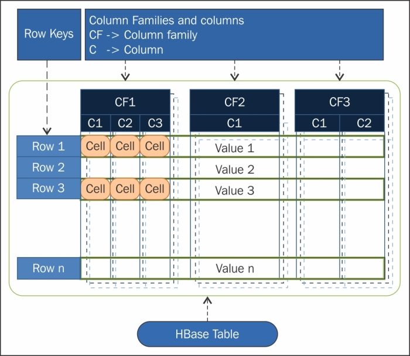
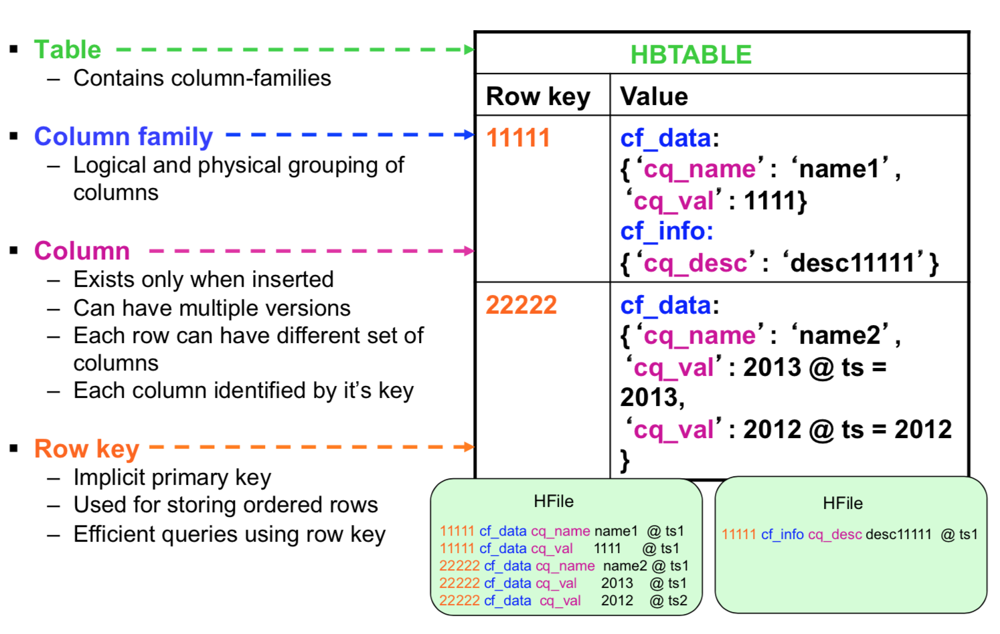
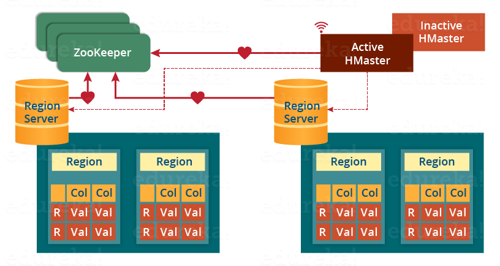
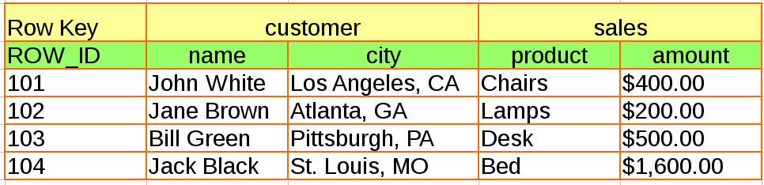
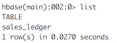
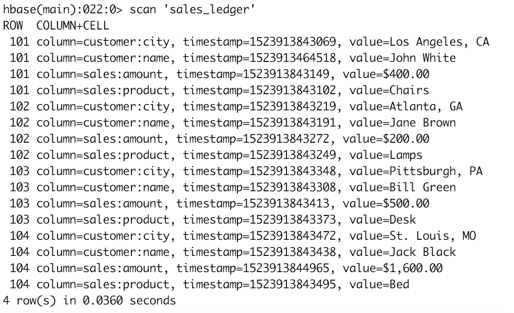
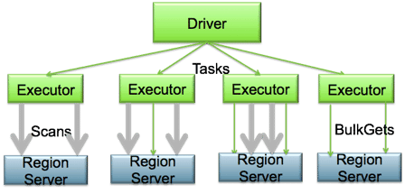
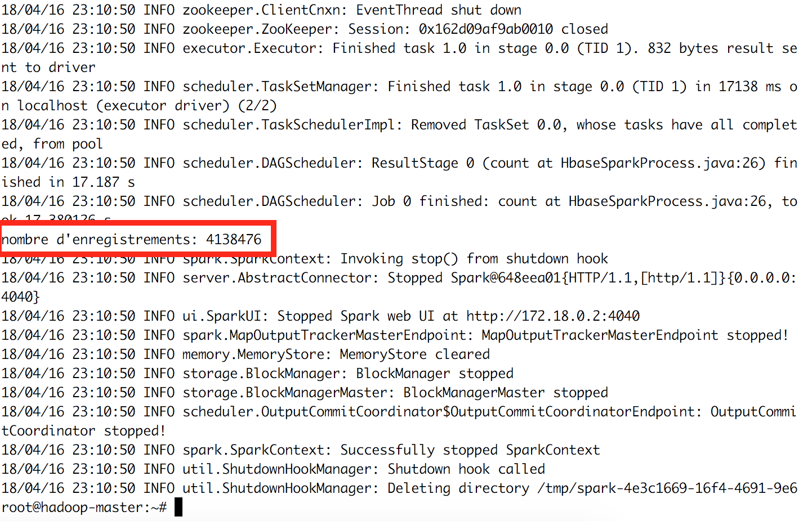

<center></center>

## Télécharger PDF
[](tp4.pdf)

## Objectifs du TP
Manipulation de données avec HBase, et traitement co-localisé avec Spark.

## Outils et Versions
* [Apache HBase](https://hbase.apache.org/) Version 1.4.7
* [Apache Hadoop](http://hadoop.apache.org/) Version: 2.7.2
* [Apache Spark](https://spark.apache.org/) Version: 2.2.1
* [Docker](https://www.docker.com/) Version 17.09.1
* [IntelliJ IDEA](https://www.jetbrains.com/idea/download/) Version Ultimate 2016.1 (ou tout autre IDE de votre choix)
* [Java](http://www.oracle.com/technetwork/java/javase/downloads/index.html) Version 1.8
* Unix-like ou Unix-based Systems (Divers Linux et MacOS)

## Apache HBase

### Présentation
HBase est un système de gestion de bases de données distribué, non-relationnel et orienté colonnes, développé au-dessus du système de fichier HDFS.
Il permet un accès aléatoire en écriture/lecture en temps réel à un très grand ensemble de données.
<center>

</center>

### Modèle de données
Le modèle se base sur six concepts, qui sont :

* **Table** : dans HBase les données sont organisées dans des tables. Les noms des tables sont des chaînes de caractères.
* **Row** : dans chaque table, les données sont organisées dans des lignes. Une ligne est identifiée par une clé unique (_RowKey_). La Rowkey n’a pas de type, elle est traitée comme un tableau d’octets.
* **Column Family** : Les données au sein d’une ligne sont regroupées par _column family_. Chaque ligne de la table a les mêmes column families, qui peuvent être peuplées ou pas. Les column families sont définies à la création de la table dans HBase. Les noms des column families sont des chaînes de caractères.
* **Column qualifier** : L’accès aux données au sein d’une column family se fait via le _column qualifier_ ou _column_. Ce dernier n’est pas spécifié à la création de la table mais plutôt à l’insertion de la donnée. Comme les rowkeys, le column qualifier n’est pas typé, il est traité comme un tableau d’octets.
* **Cell** : La combinaison du RowKey, de la Column Family ainsi que la Column qualifier identifie d’une manière unique une cellule. Les données stockées dans une cellule sont appelées les _valeurs_ de cette cellule. Les valeurs n’ont pas de type, ils sont toujours considérés comme tableaux d’octets.
* **Version** : Les valeurs au sein d’une cellule sont versionnés. Les versions sont identifiés par leur _timestamp_ (de type long). Le nombre de versions est configuré via la Column Family. Par défaut, ce nombre est égal à trois.


<center>

</center>

Les données dans HBase sont stockées sous forme de _HFiles_, par colonnes, dans HDFS. Chaque _HFile_ se charge de stocker des données correspondantes à une _column family_ particulière.

<center>

</center>

Autres caractéristiques de HBase:

* HBase n'a pas de schéma prédéfini, sauf qu'il faut définir les familles de colonnes à la création des tables, car elles représentent l'organisation physique des données
* HBase est décrite comme étant un magasin de données clef/valeur, où la clef est la combinaison (_row_-_column family_-_column_-_timestamp_) représente la clef, et la _cell_ représente la valeur.

### Architecture

Physiquement, HBase est composé de trois types de serveurs de type Master/Slave.

* **Region Servers**: permettent de fournir les données pour lectures et écritures. Pour accéder aux données, les clients communiquent avec les RegionServers directement.
* **HBase HMaster** : gère l'affectation des régions, les opérations de création et suppression de tables.
* **Zookeeper**: permet de maintenir le cluster en état.

Le DataNode de Hadoop permet de stocker les données que le Region Server gère. Toutes les données de HBase sont stockées dans des fichiers HDFS. Les RegionServers sont colocalisés avec les DataNodes.

Le NameNode permet de maintenir les métadonnées sur tous les blocs physiques qui forment les fichiers.

<center>

</center>

Les tables HBase sont divisées horizontalement, par _row_ en plusieurs **Regions**. Une region contient toutes les lignes de la table comprises entre deux clefs données. Les regions sont affectées à des noeuds dans le cluster, appelés _Region Servers_, qui permettent de servir les données pour la lecture et l'écriture. Un _region server_ peut servir jusqu'à 1000 régions.

Le HBase Master est responsable de coordonner les _region servers_ en assignant les régions au démarrage, les réassignant en cas de récupération ou d'équilibrage de charge, et en faisant le monitoring des instances des _region servers_ dans le cluster. Il permet également de fournir une interface pour la création, la suppression et la modification des tables.

HBase utilise Zookeeper comme service de coordination pour maintenir l'état du serveur dans le cluster. Zookeeper sait quels serveurs sont actifs et disponibles, et fournit une notification en cas d'échec d'un serveur.

### Installation
HBase est installé sur le même cluster que précédemment. Suivre les étapes décrites dans la partie _Installation_ du [TP1](tp1/index.html#installation) pour télécharger l'image et exécuter les trois contenaires. Si cela est déjà fait, il suffit de lancer vos machines grâce aux commandes suivantes:

```Bash
  docker start hadoop-master hadoop-slave1 hadoop-slave2
```

puis d'entrer dans le contenaire master:

```Bash
    docker exec -it hadoop-master bash
```

Lancer ensuite les démons yarn et hdfs:
```Bash
  ./start-hadoop.sh
```

Lancer HBase en tapant :
```Bash
  start-hbase.sh
```

Une fois c'est fait, en tapant `jps`, vous devriez avoir un résultat ressemblant au suivant:

  ```Bash
  161 NameNode
  1138 HRegionServer
  499 ResourceManager
  1028 HMaster
  966 HQuorumPeer
  1499 Jps
  348 SecondaryNameNode
  ```
Vous remarquerez que tous les démons Hadoop (NameNode, SecondaryNameNode et ResourceManager) ainsi que les démons HBase (HRegionServer, HMaster et HQuorumPeer (Zookeeper)) sont démarrés.

## Première manipulation de HBase
### HBase Shell
Pour manipuler votre base de données avec son shell interactif, vous devez lancer le script suivant:
```Bash
  hbase shell
```

Vous obtiendrez une interface ressemblant à la suivante:
<center>

</center>

Nous allons créer une base de données qui contient les données suivantes:

<center>

</center>

1. Commençons par créer la table, ainsi que les familles de colonnes associées:
```Bash
create 'sales_ledger','customer','sales'
```
2. Vérifier que la table est bien créée:
```Bash
list
```
Vous devriez obtenir le résultat suivant:
<center>

</center>
3. Insérer les différentes lignes:
```Bash
put 'sales_ledger','101','customer:name','John White'
put 'sales_ledger','101','customer:city','Los Angeles, CA'
put 'sales_ledger','101','sales:product','Chairs'
put 'sales_ledger','101','sales:amount','$400.00'

put 'sales_ledger','102','customer:name','Jane Brown'
put 'sales_ledger','102','customer:city','Atlanta, GA'
put 'sales_ledger','102','sales:product','Lamps'
put 'sales_ledger','102','sales:amount','$200.00'

put 'sales_ledger','103','customer:name','Bill Green'
put 'sales_ledger','103','customer:city','Pittsburgh, PA'
put 'sales_ledger','103','sales:product','Desk'
put 'sales_ledger','103','sales:amount','$500.00'

put 'sales_ledger','104','customer:name','Jack Black'
put 'sales_ledger','104','customer:city','St. Louis, MO'
put 'sales_ledger','104','sales:product','Bed'
put 'sales_ledger','104','sales:amount','$1,600.00'
```
4. Visualiser le résultat de l'insertion, en tapant:
```Bash
scan 'sales_ledger'
```
<center>

</center>
5. Afficher les valeurs de la colonne _product_ de la ligne _102_
```Bash
get 'sales_ledger','102',{COLUMN => 'sales:product'}
```
Vous obtiendrez:
<center>

</center>
6. Vous pourrez quitter le shell en tapant:
```Bash
exit
```

### HBase API
HBase fournit une API en Java pour pouvoir manipuler programmatiquement les données de la base. Nous allons montrer ici un exemple très simple.

1. Dans votre contenaire principal, créer un répertoire _hbase-code_ à l'emplacement de votre choix, puis déplacez-vous dedans.
```Bash
mkdir hbase-code
cd hbase-code
```
2. Créer l'arborescence _tn/insat/tp4_ dans ce répertoire:
```Bash
mkdir -p tn/insat/tp4
```
3. Créer et ouvrir le fichier _HelloHBase.java_ sous le répertoire tp4:
```Bash
vim tn/insat/tp4/HelloHBase.java
```
4. Insérer le code suivant dans le fichier:
```Java
package tn.insat.tp4;

import org.apache.hadoop.conf.Configuration;
import org.apache.hadoop.hbase.HBaseConfiguration;
import org.apache.hadoop.hbase.HColumnDescriptor;
import org.apache.hadoop.hbase.HTableDescriptor;
import org.apache.hadoop.hbase.TableName;
import org.apache.hadoop.hbase.client.*;
import org.apache.hadoop.hbase.util.Bytes;

import java.io.IOException;

public class HelloHBase {

    private Table table1;
    private String tableName = "user";
    private String family1 = "PersonalData";
    private String family2 = "ProfessionalData";

    public void createHbaseTable() throws IOException {
        Configuration config = HBaseConfiguration.create();
        Connection connection = ConnectionFactory.createConnection(config);
        Admin admin = connection.getAdmin();

        HTableDescriptor ht = new HTableDescriptor(TableName.valueOf(tableName));
        ht.addFamily(new HColumnDescriptor(family1));
        ht.addFamily(new HColumnDescriptor(family2));
        System.out.println("connecting");

        System.out.println("Creating Table");
        createOrOverwrite(admin, ht);
        System.out.println("Done......");

        table1 = connection.getTable(TableName.valueOf(tableName));

        try {
            System.out.println("Adding user: user1");
            byte[] row1 = Bytes.toBytes("user1");
            Put p = new Put(row1);

            p.addColumn(family1.getBytes(), "name".getBytes(), Bytes.toBytes("ahmed"));
            p.addColumn(family1.getBytes(), "address".getBytes(), Bytes.toBytes("tunis"));
            p.addColumn(family2.getBytes(), "company".getBytes(), Bytes.toBytes("biat"));
            p.addColumn(family2.getBytes(), "salary".getBytes(), Bytes.toBytes("10000"));
            table1.put(p);

            System.out.println("Adding user: user2");
            byte[] row2 = Bytes.toBytes("user2");
            Put p2 = new Put(row2);
            p2.addColumn(family1.getBytes(), "name".getBytes(), Bytes.toBytes("imen"));
            p2.addColumn(family1.getBytes(), "tel".getBytes(), Bytes.toBytes("21212121"));
            p2.addColumn(family2.getBytes(), "profession".getBytes(), Bytes.toBytes("educator"));
            p2.addColumn(family2.getBytes(), "company".getBytes(), Bytes.toBytes("insat"));
            table1.put(p2);

            System.out.println("reading data...");
            Get g = new Get(row1);

            Result r = table1.get(g);
            System.out.println(Bytes.toString(r.getValue(family1.getBytes(), "name".getBytes())));

        } catch (Exception e) {
            e.printStackTrace();
        } finally {
            table1.close();
            connection.close();
        }
    }

    public static void createOrOverwrite(Admin admin, HTableDescriptor table) throws IOException {
        if (admin.tableExists(table.getTableName())) {
            admin.disableTable(table.getTableName());
            admin.deleteTable(table.getTableName());
        }
        admin.createTable(table);
    }

    public static void main(String[] args) throws IOException {
        HelloHBase admin = new HelloHBase();
        admin.createHbaseTable();
    }
}
```
Ce code permet de réaliser les opérations suivantes:
  4.1. Créer une table appelée "_user_" contenant deux familles de colonnes: "_PersonalData_" et "_ProfessionalData_". Si cette table existe déjà, elle sera écrasée.
  4.2. Insérer deux enregistrements dans cette table.
  4.3. Lire la valeur de la colonne 'PersonalData:name' de la ligne 'user1'

5. Tout en restant sous le répertoire _hbase-code_, compiler cette classe:
```Bash
javac tn/insat/tp4/HelloHBase.java
```

!!! tip "Remarque"

      Ce code devrait compiler sans problèmes, car la librairie HBase est déjà incluse dans le classpath par défaut, grâce à la variable d'environnement $CLASSPATH.

  Exécuter ce code:
  ```Bash
  java tn.insat.tp4.HelloHBase
  ```
Le résultat devrait ressembler au suivant:
<center>

</center>

## Chargement de fichiers
Il est possible de charger des fichiers volumineux dans la base HBase, à partir de HDFS. Nous vous fournissons pour cela le fichier _purchases2.txt_ que vous trouverez directement sous le répertoire /root de votre contenaire.

!!! tip "Remarque"

      Ce fichier n'est autre que le fichier _purchases.txt_, légèrement modifié: un numéro unique est rajouté au début de chaque ligne, que nous utiliserons comme clef pour chaque enregistrement, et la séparation entre les colonnes a été remplacée par une virgule (,) au lieu d'une tabluation.

1. Commencer par charger le fichier dans le répertoire _input_ de HDFS (mais d'abord, créer ce répertoire s'il n'existe pas déjà):
```Bash
hadoop fs -mkdir -p input
hadoop fs -put purchases2.txt input
```
2. Créer la base _products_ avec une famille de colonnes _cf_
```Bash
hbase shell
create 'products','cf'
exit
```
3. Exécuter la commande suivante. _ImportTsv_ est une utilité qui permet de charger des données au format _tsv_ dans HBase. Elle permet de déclencher une opération MapReduce sur le fichier principal stocké dans HDFS, pour lire les données puis les insérer via des _put_ dans la base.
```Bash
hbase org.apache.hadoop.hbase.mapreduce.ImportTsv \
    -Dimporttsv.separator=',' \
    -Dimporttsv.columns=HBASE_ROW_KEY,cf:date,cf:time,cf:town,cf:product,cf:price,cf:payment \
    products input
```
4. Vérifier que la base a bien été créée en consultant la ville de l'enregistrement numéro 2000:
```Bash
hbase shell
get 'products','2000',{COLUMN => 'cf:town'}
```
Vous devriez obtenir le résultat suivant:
<center>

</center>

## Traitement de données avec Spark
Installé sur le même cluster que HBase, Spark peut être utilisé pour réaliser des traitements complexes sur les données de HBase. Pour cela, les différents Executors de Spark seront co-localisés avec les region servers, et pourront réaliser des traitements parallèles directement là où les données sont stockées.

<center>

</center>

Nous allons réaliser un traitement simple pour montrer comment greffer spark sur HBase.

1. Ouvrir IntelliJ IDEA, et créer un nouveau projet Maven.
2. Utiliser le fichier POM suivant:
```xml
<?xml version="1.0" encoding="UTF-8"?>

<project xmlns="http://maven.apache.org/POM/4.0.0"
         xmlns:xsi="http://www.w3.org/2001/XMLSchema-instance"
         xsi:schemaLocation="http://maven.apache.org/POM/4.0.0 http://maven.apache.org/xsd/maven-4.0.0.xsd">
    <modelVersion>4.0.0</modelVersion>

    <groupId>hbase.spark</groupId>
    <artifactId>processing</artifactId>
    <version>1</version>
    <build>
        <plugins>
            <plugin>
                <groupId>org.apache.maven.plugins</groupId>
                <artifactId>maven-compiler-plugin</artifactId>
                <configuration>
                    <source>1.8</source>
                    <target>1.8</target>
                </configuration>
            </plugin>
        </plugins>
    </build>

    <dependencies>

      <dependency>
            <groupId>org.apache.hbase</groupId>
            <artifactId>hbase</artifactId>
            <version>2.1.3</version>
            <type>pom</type>
        </dependency>

        <dependency>
            <groupId>org.apache.hbase</groupId>
            <artifactId>hbase-spark</artifactId>
            <version>2.0.0-alpha4</version>
        </dependency>

        <dependency>
            <groupId>org.apache.spark</groupId>
            <artifactId>spark-core_2.11</artifactId>
            <version>2.2.1</version>
        </dependency>
    </dependencies>
</project>
```
3. Créer la classe tn.insat.tp4.HbaseSparkProcess dont le code est le suivant:
```Java
package tn.insat.tp4;

import org.apache.hadoop.conf.Configuration;
import org.apache.hadoop.hbase.HBaseConfiguration;
import org.apache.hadoop.hbase.client.Result;
import org.apache.hadoop.hbase.io.ImmutableBytesWritable;
import org.apache.hadoop.hbase.mapreduce.TableInputFormat;
import org.apache.spark.SparkConf;
import org.apache.spark.api.java.JavaPairRDD;
import org.apache.spark.api.java.JavaSparkContext;

public class HbaseSparkProcess {

    public void createHbaseTable() {
        Configuration config = HBaseConfiguration.create();
        SparkConf sparkConf = new SparkConf().setAppName("SparkHBaseTest").setMaster("local[4]");
        JavaSparkContext jsc = new JavaSparkContext(sparkConf);

        config.set(TableInputFormat.INPUT_TABLE,"products");

        JavaPairRDD<ImmutableBytesWritable, Result> hBaseRDD =
                jsc.newAPIHadoopRDD(config, TableInputFormat.class, ImmutableBytesWritable.class, Result.class);

        System.out.println("nombre d'enregistrements: "+hBaseRDD.count());

    }

    public static void main(String[] args){
        HbaseSparkProcess admin = new HbaseSparkProcess();
        admin.createHbaseTable();
    }

}
```
Ce code permet de lire la table _products_ que nous avions précédemment créée, puis de créer un RDD en mémoire la représentant. Un Job spark permettra de compter le nombre d'éléments dans la base.
4. Faire un ```mvn install package``` sur le projet. Un fichier _processing-1.jar_ sera créé dans le répertoire target du projet.
5. Copier ce fichier dans votre contenaire:
```Bash
docker cp target/processing-1.jar hadoop-master:/root/
```
6. Copier tous les fichiers de la bibliothèque hbase dans le répertoire jars de spark:
```Bash
cp -r $HBASE_HOME/lib/* $SPARK_HOME/jars
```
7. Exécuter ce fichier grâce à _spark-submit_ comme suit:
```Bash
spark-submit  --class tn.insat.tp4.HbaseSparkProcess --master yarn --deploy-mode client processing-1.jar
```
Le résultat qui devra s'afficher ressemblera au suivant:
<center>

</center>

!!!question "Activité"

      Modifier ce code pour qu'il puisse faire la somme des ventes de tous les produits.


## Homework
Pour la phase finale de votre projet, intégrez une base de données NOSQL. Cela peut être HBase, ou bien toute autre base telle que MongoDB ou Cassandra. L'objectif est de stocker dans cette base le résultat des traitements réalisés précédemment. Il est ensuite demandé d'utiliser un outil de visualisation de votre choix pour afficher des courbes ou graphes.